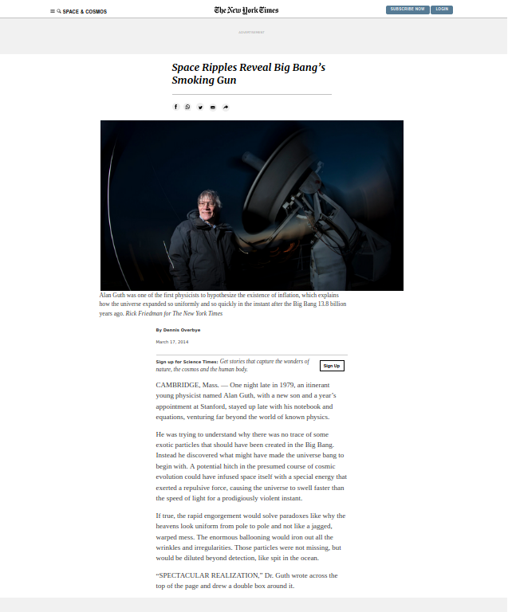

# Project Name

> This assignment consists of making a clone of a New York Times article page.
> The main purpose is to learn and apply these concepts to the project:

- Embedding images
- The box model
- Flexbox
- Grid
- Floats
- Positioning

_The original page can be seen [here](https://www.nytimes.com/2014/03/18/science/space/detection-of-waves-in-space-buttresses-landmark-theory-of-big-bang.html?_r=0)._

Additional description about the project and its features.

## Built With

- HTML5
- CSS3

## Author

👤 **Ênio Neves de Souza**

- GitHub: [@enionsouza](https://github.com/enionsouza)

## 🤝 Contributing

This project is meant for learning purposes only. Please, fell free to contact me for any sugestions or contributions.

## Show your support

Give a ⭐️ if you like this project!

## Acknowledgments

- Ángel Diaz ([@ad9311](https://github.com/ad9311/))
